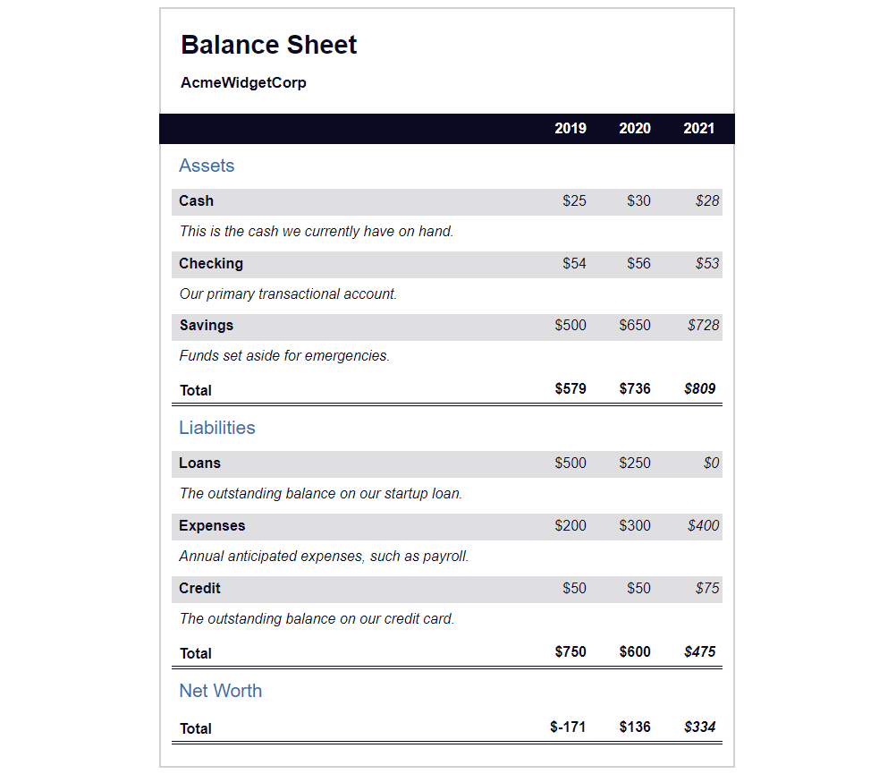

# A BALANCE SHEET WEBPAGE

> A balance sheet built using pseudo selector to change the style of an element
> when you over it with mouse, and triger the webpage.



Additional description of the project and its features.

## Built With

- HTML element,
  `section`, `span`, `div`, `caption`
  `th`, `td`, `tr` etc.

- CSS Properties,

  `h1 .flex`
  `display`: `flex`;
  `flex-direction`: `column-reverse`;
  `gap`,

  `section`, `max-width`: `40rem`;
  `margin`: 0 auto;
  `border`

  `h1 .flex span:last-of-type` `font-size`: `1.2em`,

  `#years` `display`: `flex`;
  `justify-content`: `flex-end`;
  `position`: `sticky`;
  `z-index`: `999`;
  `top`: `0;`
  `background`: `#0a0a23`;
  `color`: `#fff`;
  `padding`: `0.5rem` `calc(1.25rem + 2px)` `0.5rem 0`;
  `margin`: `0 -2px;`

- Linters
  - [Prettier](https://prettier.io/),
  - [Stylelint](https://stylelint.io/).
- GitHub Action

## Live Demo

[Live Demo Link](https://oladelele-balance-sheet.netlify.app/)

### Development (Running locally)

- Clone the project

```bash
git clone git@github.com:olayinka-oladele/balance-sheet.git

```

- Install Dependencies

```bash
yarn install
```

To run StyleLint by itself, you may run the lint task:

```bash
yarn lint:check
```

Or to automatically fix issues found (where possible):

```bash
yarn lint
```

You can also check against Prettier:

```bash
yarn format:check
```

and to have it fix (to the best of its ability) any format issues, run:

```bash
yarn format
```

You can also check against Webhint:

```bash
yarn hint
```

## Style Guides

- [CSS Style Guide](http://udacity.github.io/frontend-nanodegree-styleguide/css.html)
- [HTML Style Guide](http://udacity.github.io/frontend-nanodegree-styleguide/index.html)
- [Git Style Guide](https://udacity.github.io/git-styleguide/)

## 👤 Author

- Github: [@olayinka-oladele](https://github.com/olayinka-oladele)
- Freecodecamp: [@olayinka-oladele](https://freecodecamp.com/author)
- Linkedin: [@olayinka-oladele](https://www.linkedin.com/in/author/)

## 🤝 Contributing

Contributions, issues and feature requests are welcome!

Feel free to check the [issues page](../../issues).

## Show your support

Give a ⭐️ if you like this project!

## Acknowledgments

- [freecodecamp](https://www.freecodecamp.org/learn/2022/responsive-web-design/learn-more-about-css-pseudo-selectors-by-building-a-balance-sheet/step-66)

## 📝 License

[MIT licensed](./LICENSE).
